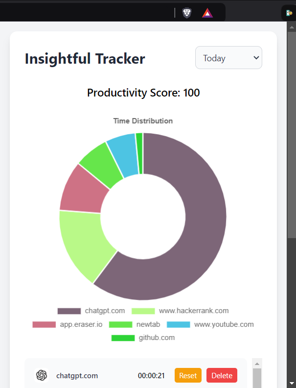
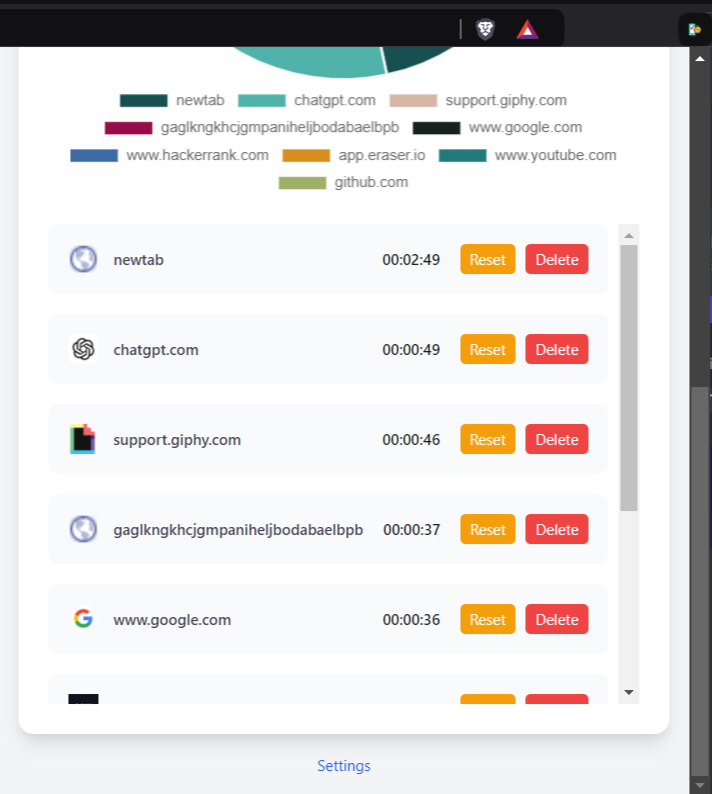
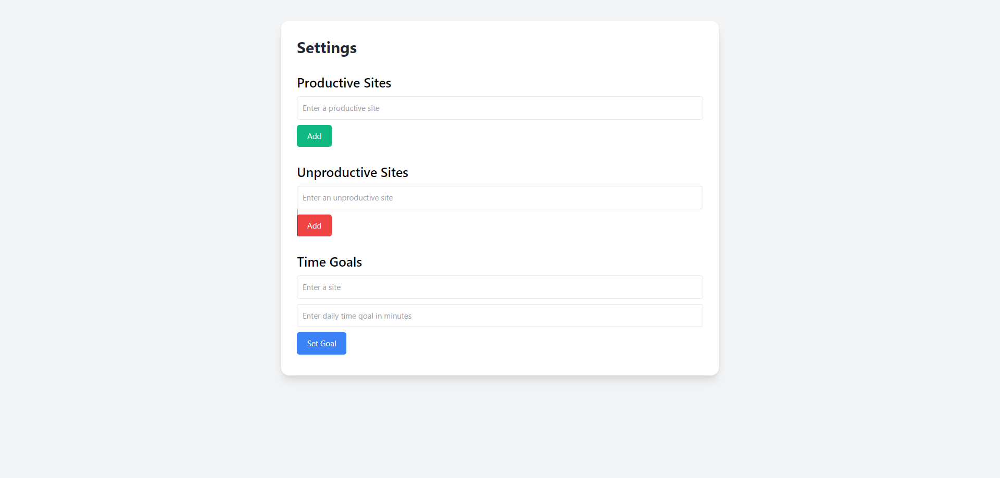

# Insightful-Tracker-Extension

**Insightful Time Tracker**

A Chrome extension designed to help users track their time spent on various websites, providing insights into their productivity and time management.

**Features**

* Tracks time spent on websites and categorizes them into productive and unproductive sites
* Sets daily time goals for specific websites or domains
* Displays a productivity score based on time spent on productive sites
* Provides a chart to visualize time spent on different websites
* Allows users to add, edit, and delete productive and unproductive sites
* Offers real-time updates to reflect changes in time spent on websites

**How it works**

1. The extension uses the Chrome Storage API to store user data, including productive and unproductive sites, time goals, and time spent on websites.
2. The background script (`background.js`) listens for tab updates and activates the extension when a new tab is opened or updated.
3. The popup script (`popup.js`) is responsible for displaying the user interface, including the chart, productivity score, and time spent on websites.
4. The options script (`options.js`) handles user input for adding, editing, and deleting productive and unproductive sites, as well as setting daily time goals.

**Technical Details**

* The extension uses the Chrome APIs for tabs, storage, and alarms.
* The chart is generated using the Chart.js library.
* The extension uses Tailwind CSS for styling.

**Installation**

To install the extension, follow these steps:

1. Clone the repository or download the code.
2. Go to the Chrome extensions page by typing `chrome://extensions/` in the address bar.
3. Enable developer mode.
4. Click "Load unpacked" and select the folder containing the extension's code.
5. The extension should now be installed and functional.

**Contributing**

If you'd like to contribute to this project, please fork the repository and submit a pull request with your changes. Make sure to follow the existing coding style and conventions.

**License**
This project is licensed under the [MIT License](https://opensource.org/licenses/MIT).

**Author**
- [Harshit Joshi](https://github.com/Harshitjoc)
